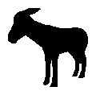
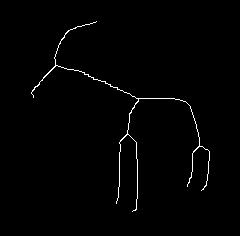

# Skeletonization




Skeletonization algorithms implemented in C++

- [x] Thinning
- [ ] Potential Fields

To compile:

```{console}
foo@bar:~/skeletonization/src$ g++ main.cpp `pkg-config --cflags --libs opencv`
foo@bar:~/skeletonization/src$ ./a.out
```
